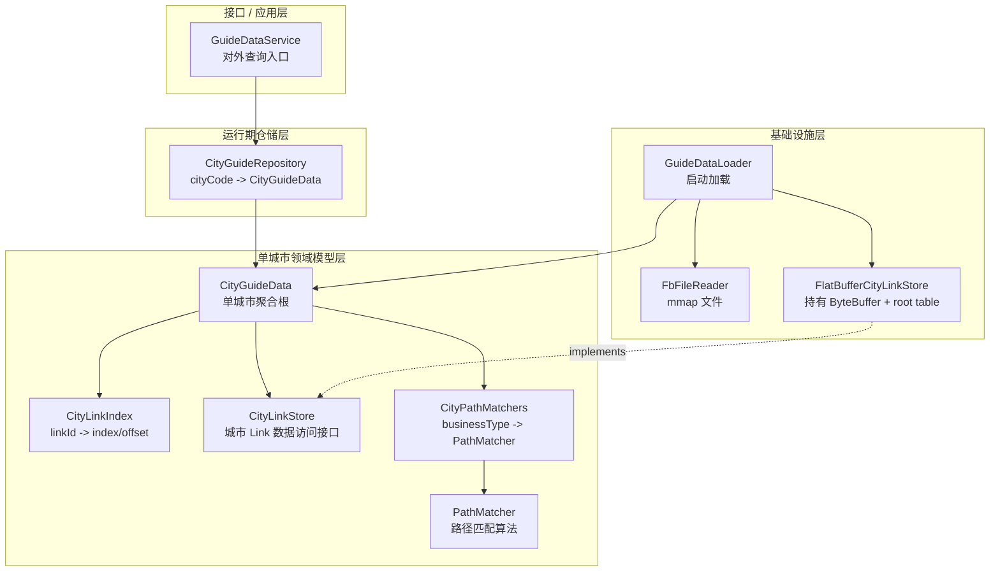
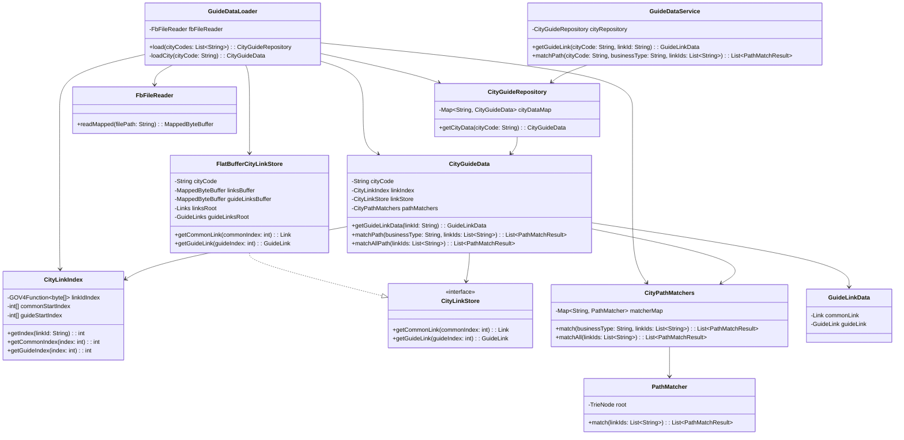

你这个担心是合理的。**上一版简化后是有分层的，但还不算特别“面向对象优雅”**，因为 `CityGuideData + CityFlatBuffers + CityLinkIndex` 这套如果用不好，很容易变成：

```text
Service 拿到 cityData
Service 再拿 flatBuffers
Service 再拿 linkIndex
Service 自己拼查询流程
```

那就确实是“面向过程拆成多个类”。

更好的设计应该遵守一句话：

> **外层对象不要到处拿内部零件自己组装流程，而是直接命令领域对象完成业务动作。**

也就是：

```java
// 不推荐：过程式
CityGuideData cityData = repository.getCityData(cityCode);
int index = cityData.getLinkIndex().getIndex(linkId);
Link link = cityData.getFlatBuffers().getLinksRoot().links(index);

// 推荐：面向对象
CityGuideData cityData = repository.getCityData(cityCode);
GuideLinkData data = cityData.getGuideLinkData(linkId);
```

------

# 1. 新设计的分层应该是这样

我建议你最终按这 4 层看：

```text
接口 / 应用层
  ↓
城市数据仓储层
  ↓
单城市领域模型层
  ↓
基础设施加载层
```

展开就是：

```text
GuideDataService
  ↓
CityGuideRepository
  ↓
CityGuideData
  ├── CityLinkIndex
  ├── CityLinkStore
  └── CityPathMatchers
        └── PathMatcher
  ↓
FlatBufferCityLinkStore / GuideDataLoader / FbFileReader
```

------

# 2. 分层图



这个分层比上一版更清楚。

------

# 3. 每一层的职责

| 层            | 类                        | 主要职责                                                 |
| ------------- | ------------------------- | -------------------------------------------------------- |
| 接口 / 应用层 | `GuideDataService`        | 对外暴露 API，做参数校验、异常转换、结果返回             |
| 仓储层        | `CityGuideRepository`     | 管理所有城市数据，按 `cityCode` 获取 `CityGuideData`     |
| 领域模型层    | `CityGuideData`           | 单城市聚合根，对外提供 `getGuideLinkData`、`matchPath`   |
| 领域组件      | `CityLinkIndex`           | 封装 MPH、`commonStartIndex`、`guideStartIndex`          |
| 领域接口      | `CityLinkStore`           | 抽象“通过 index 获取 Link / GuideLink”                   |
| 领域组件      | `CityPathMatchers`        | 管理一个城市下多个业务类型的 `PathMatcher`               |
| 算法组件      | `PathMatcher`             | 只负责 AC / Trie 路径匹配                                |
| 基础设施层    | `FlatBufferCityLinkStore` | 持有当前城市的 `Links.fbs`、`GuideLinks.fbs`、root table |
| 基础设施层    | `GuideDataLoader`         | 服务启动时加载所有城市数据                               |
| 基础设施层    | `FbFileReader`            | mmap 文件读取                                            |

------

# 4. 关键优化：把 `CityFlatBuffers` 改成 `CityLinkStore`

上一版的 `CityFlatBuffers` 有点偏底层，而且名字暴露了实现细节。更面向对象的方式是定义一个接口：

```java
public interface CityLinkStore {

    Link getCommonLink(int commonIndex);

    GuideLink getGuideLink(int guideIndex);
}
```

然后 FlatBuffer 只是它的一种实现：

```java
public class FlatBufferCityLinkStore implements CityLinkStore {

    private final String cityCode;

    private final MappedByteBuffer linksBuffer;
    private final MappedByteBuffer guideLinksBuffer;

    private final Links linksRoot;
    private final GuideLinks guideLinksRoot;

    public FlatBufferCityLinkStore(
            String cityCode,
            MappedByteBuffer linksBuffer,
            MappedByteBuffer guideLinksBuffer
    ) {
        this.cityCode = cityCode;
        this.linksBuffer = linksBuffer;
        this.guideLinksBuffer = guideLinksBuffer;
        this.linksRoot = Links.getRootAsLinks(linksBuffer);
        this.guideLinksRoot = GuideLinks.getRootAsGuideLinks(guideLinksBuffer);
    }

    @Override
    public Link getCommonLink(int commonIndex) {
        return linksRoot.links(commonIndex);
    }

    @Override
    public GuideLink getGuideLink(int guideIndex) {
        return guideLinksRoot.guideLinks(guideIndex);
    }
}
```

这样 `CityGuideData` 就不需要知道底层是 FlatBuffer、ByteBuffer、还是别的存储。

它只知道：

```text
我有一个 CityLinkStore，可以通过 index 取 link 数据。
```

这就更面向对象。

------

# 5. `CityGuideData` 才是真正的领域对象

它不是简单包装类。它应该是 **单城市聚合根**。

它负责把这几个东西组合起来：

```text
CityLinkIndex
  负责 linkId -> index

CityLinkStore
  负责 index -> Link / GuideLink

CityPathMatchers
  负责 path 匹配
```

代码应该像这样：

```java
public class CityGuideData {

    private final String cityCode;
    private final CityLinkIndex linkIndex;
    private final CityLinkStore linkStore;
    private final CityPathMatchers pathMatchers;

    public GuideLinkData getGuideLinkData(String linkId) {
        int index = linkIndex.getIndex(linkId);
        if (index < 0) {
            return null;
        }

        int commonIndex = linkIndex.getCommonIndex(index);
        int guideIndex = linkIndex.getGuideIndex(index);

        Link commonLink = linkStore.getCommonLink(commonIndex);
        GuideLink guideLink = linkStore.getGuideLink(guideIndex);

        return new GuideLinkData(commonLink, guideLink);
    }

    public List<PathMatchResult> matchPath(
            String businessType,
            List<String> linkIds
    ) {
        return pathMatchers.match(businessType, linkIds);
    }

    public List<PathMatchResult> matchAllPath(List<String> linkIds) {
        return pathMatchers.matchAll(linkIds);
    }
}
```

这里比较 OO 的点在于：

```text
GuideDataService 不知道 linkId 怎么变成 index
GuideDataService 不知道 index 怎么查 FlatBuffer
GuideDataService 不知道 matcherMap 怎么组织
GuideDataService 只知道问 CityGuideData 要结果
```

这就是对象封装。

------

# 6. `GuideDataService` 要保持薄

`GuideDataService` 不要写太多底层逻辑。

```java
public class GuideDataService {

    private final CityGuideRepository cityRepository;

    public GuideLinkData getGuideLink(String cityCode, String linkId) {
        return cityRepository
                .getCityData(cityCode)
                .getGuideLinkData(linkId);
    }

    public List<PathMatchResult> matchPath(
            String cityCode,
            String businessType,
            List<String> linkIds
    ) {
        return cityRepository
                .getCityData(cityCode)
                .matchPath(businessType, linkIds);
    }
}
```

这样它是应用服务，不是过程控制器。

------

# 7. 最终类图，推荐这一版



------

# 8. 这是不是“过度设计”？

我觉得这一版不算过度，因为它只保留了几个真正有价值的抽象：

| 抽象                      | 是否有必要   | 原因                                 |
| ------------------------- | ------------ | ------------------------------------ |
| `CityGuideRepository`     | 有必要       | 管所有城市数据，隐藏 `Map`           |
| `CityGuideData`           | 很有必要     | 单城市聚合根，承载业务行为           |
| `CityLinkIndex`           | 有必要       | MPH 和 offset 索引逻辑独立           |
| `CityLinkStore`           | 有必要但可选 | 隔离 FlatBuffer 细节，更 OO          |
| `FlatBufferCityLinkStore` | 有必要       | 管 ByteBuffer 和 root table 生命周期 |
| `CityPathMatchers`        | 有必要       | 一个城市多个业务 matcher             |
| `GuideRuntimeContext`     | 没必要       | 只是包装 Map，语义不如 Repository    |
| `GuideLinkQueryService`   | 暂时没必要   | 目前只是转发                         |
| `GuidePathMatchService`   | 暂时没必要   | 目前只是转发                         |

------

# 9. 一句话判断是不是面向对象

看调用方代码就知道了。

如果你的调用链是这样：

```java
repository.getCityData(city)
          .getFlatBuffers()
          .getGuideLinksRoot()
          .guideLinks(index);
```

那就是过程式。

如果你的调用链是这样：

```java
repository.getCityData(city)
          .getGuideLinkData(linkId);
```

那就是面向对象。

因为后者把细节都封装到了 `CityGuideData` 内部。

------

所以我的最终建议是：

> **保留 `CityGuideRepository + CityGuideData + CityLinkIndex + CityLinkStore + CityPathMatchers`。去掉 `GuideRuntimeContext`。让 `CityGuideData` 成为单城市聚合根，对外只暴露业务方法，不暴露 FlatBuffer、root table、index 这些内部细节。**