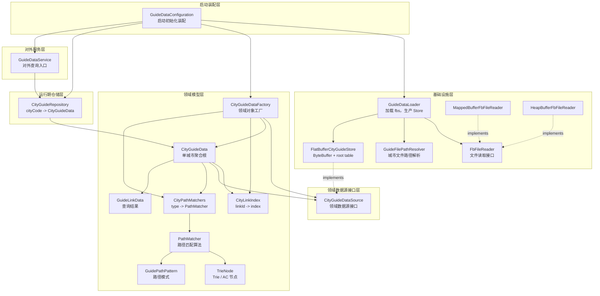
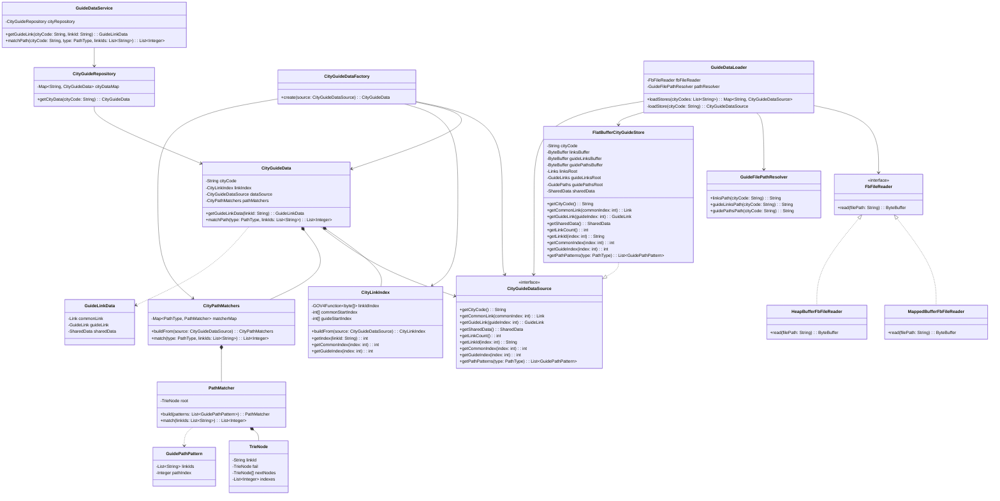
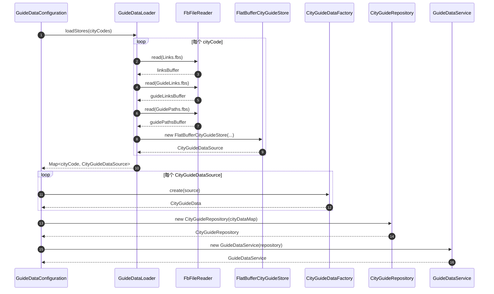
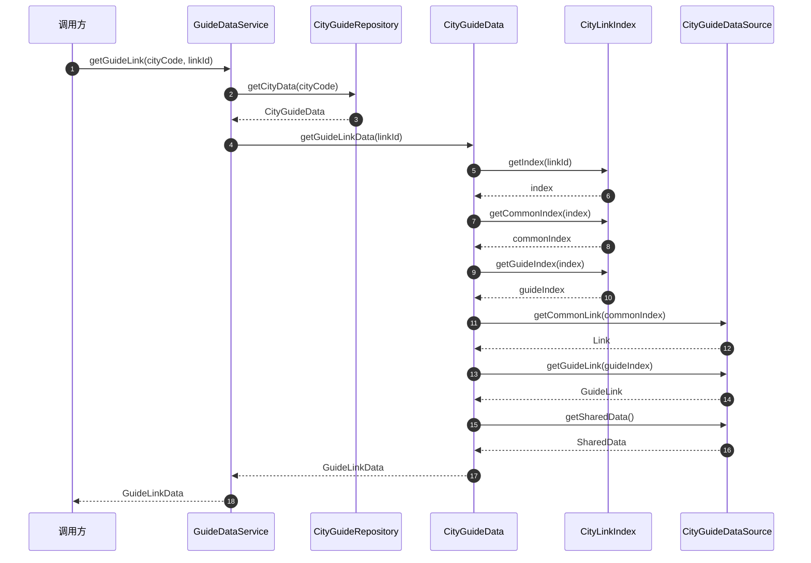
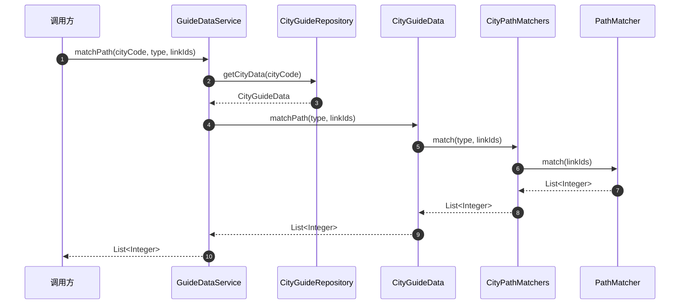
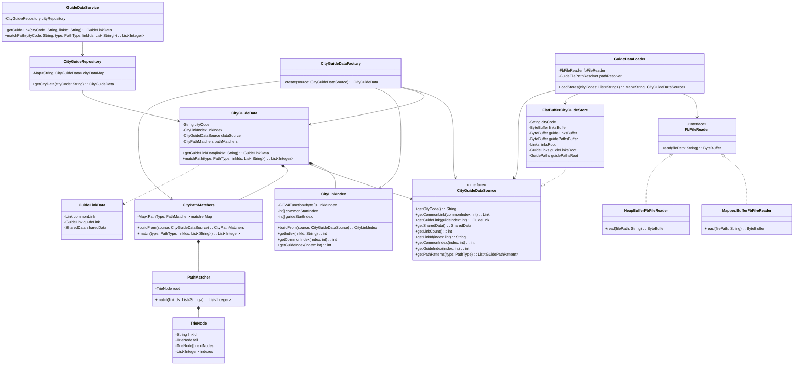
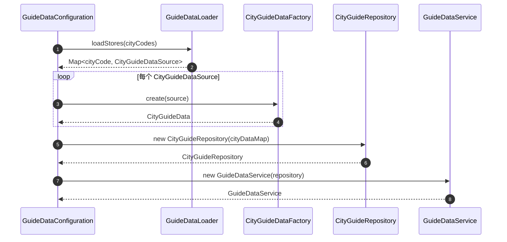

# Guide 数据服务最终技术方案

## 1. 背景

当前 Guide 数据服务在启动时一次性加载所有目标城市的数据，运行期只做内存只读查询。

每个城市对应三类 fbs 文件：

```text
cityCode
  ├── Links.fbs
  ├── GuideLinks.fbs
  └── GuidePaths.fbs
```

运行期主要提供两类能力：

```text
1. 根据 cityCode + linkId 查询 Link / GuideLink / SharedData
2. 根据 cityCode + type + linkIds 做路径匹配
```

------

## 2. 最终设计原则

本方案按以下原则设计：

```text
1. GuideDataLoader 只负责基础设施加载
   - 读取 fbs 文件
   - 创建 FlatBufferCityGuideStore
   - 不构建业务索引
   - 不构建 matcher
   - 不构建 repository

2. FlatBufferCityGuideStore 负责适配 fbs 数据
   - 持有 ByteBuffer
   - 持有 FlatBuffer root table
   - 实现 CityGuideDataSource 接口
   - 不承载业务逻辑

3. CityGuideDataFactory 负责构建领域对象
   - 根据 CityGuideDataSource 构建 CityLinkIndex
   - 根据 CityGuideDataSource 构建 CityPathMatchers
   - 最终组装 CityGuideData

4. CityGuideData 是单城市聚合根
   - 对外提供 getGuideLinkData
   - 对外提供 matchPath
   - 封装 linkId -> index -> Link / GuideLink 的过程

5. CityGuideRepository 管理所有城市
   - 持有 Map<cityCode, CityGuideData>
   - 运行期按 cityCode 查找城市数据

6. GuideDataService 是对外服务入口
   - 不接触 ByteBuffer
   - 不接触 FlatBuffer root table
   - 不接触索引和 matcher 细节
```

------

## 3. 最终分层

```text
对外服务层
  GuideDataService

运行期仓储层
  CityGuideRepository

领域模型层
  CityGuideData
  CityGuideDataFactory
  CityLinkIndex
  CityPathMatchers
  PathMatcher
  TrieNode
  GuideLinkData
  GuidePathPattern

领域数据源接口层
  CityGuideDataSource

基础设施层
  GuideDataLoader
  FlatBufferCityGuideStore
  FbFileReader
  MappedBufferFbFileReader
  HeapBufferFbFileReader
  GuideFilePathResolver

启动装配层
  GuideDataConfiguration
```

其中 `GuideDataConfiguration` 可以是 Spring Configuration 或应用启动初始化代码，不一定需要单独设计成一个核心业务类。

------

## 4. 分层关系图



------

## 5. 最终类图



------

## 6. 核心类职责

### 6.1 GuideDataService

所属层：**对外服务层**

职责：

```text
1. 对外提供查询 API
2. 根据 cityCode 从 CityGuideRepository 获取 CityGuideData
3. 调用 CityGuideData 的业务方法
4. 不关心底层数据如何加载、如何存储、如何匹配
```

示例：

```java
public class GuideDataService {

    private final CityGuideRepository cityRepository;

    public GuideLinkData getGuideLink(String cityCode, String linkId) {
        return cityRepository
                .getCityData(cityCode)
                .getGuideLinkData(linkId);
    }

    public List<Integer> matchPath(
            String cityCode,
            PathType type,
            List<String> linkIds
    ) {
        return cityRepository
                .getCityData(cityCode)
                .matchPath(type, linkIds);
    }
}
```

------

### 6.2 CityGuideRepository

所属层：**运行期仓储层**

职责：

```text
1. 管理所有城市的 CityGuideData
2. 根据 cityCode 获取单城市数据
3. 隐藏 Map<cityCode, CityGuideData>
```

示例：

```java
public class CityGuideRepository {

    private final Map<String, CityGuideData> cityDataMap;

    public CityGuideRepository(Map<String, CityGuideData> cityDataMap) {
        this.cityDataMap = Map.copyOf(cityDataMap);
    }

    public CityGuideData getCityData(String cityCode) {
        CityGuideData cityData = cityDataMap.get(cityCode);
        if (cityData == null) {
            throw new IllegalArgumentException("City data not found: " + cityCode);
        }
        return cityData;
    }
}
```

------

### 6.3 CityGuideData

所属层：**领域模型层**

职责：

```text
1. 单城市聚合根
2. 聚合 CityLinkIndex、CityGuideDataSource、CityPathMatchers
3. 对外提供 getGuideLinkData 和 matchPath
4. 封装 linkId -> index -> commonIndex / guideIndex -> Link / GuideLink 的完整流程
```

示例：

```java
public class CityGuideData {

    private final String cityCode;
    private final CityLinkIndex linkIndex;
    private final CityGuideDataSource dataSource;
    private final CityPathMatchers pathMatchers;

    public GuideLinkData getGuideLinkData(String linkId) {
        int index = linkIndex.getIndex(linkId);
        if (index < 0) {
            return null;
        }

        int commonIndex = linkIndex.getCommonIndex(index);
        int guideIndex = linkIndex.getGuideIndex(index);

        Link commonLink = dataSource.getCommonLink(commonIndex);
        GuideLink guideLink = dataSource.getGuideLink(guideIndex);
        SharedData sharedData = dataSource.getSharedData();

        return new GuideLinkData(commonLink, guideLink, sharedData);
    }

    public List<Integer> matchPath(PathType type, List<String> linkIds) {
        return pathMatchers.match(type, linkIds);
    }
}
```

这个类是本方案的核心领域对象。

外层不应该写成：

```java
cityData.getDataSource().getGuideLink(...);
cityData.getLinkIndex().getCommonIndex(...);
```

而应该只写成：

```java
cityData.getGuideLinkData(linkId);
cityData.matchPath(type, linkIds);
```

------

### 6.4 CityGuideDataSource

所属层：**领域数据源接口层**

职责：

```text
1. 定义领域层需要的数据能力
2. 屏蔽 FlatBuffer 细节
3. 不暴露 ByteBuffer
4. 不暴露 Links / GuideLinks / GuidePaths root table
```

示例：

```java
public interface CityGuideDataSource {

    String getCityCode();

    Link getCommonLink(int commonIndex);

    GuideLink getGuideLink(int guideIndex);

    SharedData getSharedData();

    int getLinkCount();

    String getLinkId(int index);

    int getCommonIndex(int index);

    int getGuideIndex(int index);

    List<GuidePathPattern> getPathPatterns(PathType type);
}
```

不建议暴露：

```java
Links getLinksRoot();
GuideLinks getGuideLinksRoot();
GuidePaths getGuidePathsRoot();
ByteBuffer getBuffer();
```

否则领域层又会重新依赖 FlatBuffer 细节。

------

### 6.5 FlatBufferCityGuideStore

所属层：**基础设施层**

职责：

```text
1. 持有当前城市的 Links.fbs / GuideLinks.fbs / GuidePaths.fbs ByteBuffer
2. 持有对应 FlatBuffer root table
3. 实现 CityGuideDataSource
4. 把 FlatBuffer 数据转换成领域层需要的数据接口
```

示例：

```java
public class FlatBufferCityGuideStore implements CityGuideDataSource {

    private final String cityCode;

    private final ByteBuffer linksBuffer;
    private final ByteBuffer guideLinksBuffer;
    private final ByteBuffer guidePathsBuffer;

    private final Links linksRoot;
    private final GuideLinks guideLinksRoot;
    private final GuidePaths guidePathsRoot;

    private final SharedData sharedData;

    public FlatBufferCityGuideStore(
            String cityCode,
            ByteBuffer linksBuffer,
            ByteBuffer guideLinksBuffer,
            ByteBuffer guidePathsBuffer
    ) {
        this.cityCode = cityCode;
        this.linksBuffer = linksBuffer;
        this.guideLinksBuffer = guideLinksBuffer;
        this.guidePathsBuffer = guidePathsBuffer;

        this.linksRoot = Links.getRootAsLinks(linksBuffer);
        this.guideLinksRoot = GuideLinks.getRootAsGuideLinks(guideLinksBuffer);
        this.guidePathsRoot = GuidePaths.getRootAsGuidePaths(guidePathsBuffer);

        this.sharedData = guideLinksRoot.sharedData();
    }

    @Override
    public Link getCommonLink(int commonIndex) {
        return linksRoot.links(commonIndex);
    }

    @Override
    public GuideLink getGuideLink(int guideIndex) {
        return guideLinksRoot.guideLinks(guideIndex);
    }

    @Override
    public List<GuidePathPattern> getPathPatterns(PathType type) {
        // 从 guidePathsRoot 中读取指定 type 的路径模式，
        // 转成领域层使用的 GuidePathPattern
        return Collections.emptyList();
    }
}
```

------

### 6.6 GuideDataLoader

所属层：**基础设施层**

职责：

```text
1. 根据 cityCode 找到对应 fbs 文件路径
2. 使用 FbFileReader 读取 ByteBuffer
3. 创建 FlatBufferCityGuideStore
4. 返回 Map<cityCode, CityGuideDataSource>
```

它不负责：

```text
1. 构建 CityLinkIndex
2. 构建 CityPathMatchers
3. 构建 CityGuideData
4. 构建 CityGuideRepository
```

示例：

```java
public class GuideDataLoader {

    private final FbFileReader fbFileReader;
    private final GuideFilePathResolver pathResolver;

    public Map<String, CityGuideDataSource> loadStores(List<String> cityCodes) {
        Map<String, CityGuideDataSource> stores = new HashMap<>();

        for (String cityCode : cityCodes) {
            stores.put(cityCode, loadStore(cityCode));
        }

        return stores;
    }

    private CityGuideDataSource loadStore(String cityCode) {
        ByteBuffer linksBuffer = fbFileReader.read(pathResolver.linksPath(cityCode));
        ByteBuffer guideLinksBuffer = fbFileReader.read(pathResolver.guideLinksPath(cityCode));
        ByteBuffer guidePathsBuffer = fbFileReader.read(pathResolver.guidePathsPath(cityCode));

        return new FlatBufferCityGuideStore(
                cityCode,
                linksBuffer,
                guideLinksBuffer,
                guidePathsBuffer
        );
    }
}
```

------

### 6.7 CityGuideDataFactory

所属层：**领域模型层**

职责：

```text
1. 接收 CityGuideDataSource
2. 构建 CityLinkIndex
3. 构建 CityPathMatchers
4. 组装 CityGuideData
```

示例：

```java
public class CityGuideDataFactory {

    public CityGuideData create(CityGuideDataSource source) {
        CityLinkIndex linkIndex = CityLinkIndex.buildFrom(source);
        CityPathMatchers pathMatchers = CityPathMatchers.buildFrom(source);

        return new CityGuideData(
                source.getCityCode(),
                linkIndex,
                source,
                pathMatchers
        );
    }
}
```

`CityGuideDataFactory` 建议保留，因为它承载的是领域对象构建逻辑，不只是普通装配。

------

### 6.8 CityLinkIndex

所属层：**领域模型层**

职责：

```text
1. 基于 CityGuideDataSource 构建 linkId -> index 的索引
2. 持有 GOV4Function
3. 持有 commonStartIndex
4. 持有 guideStartIndex
```

示例：

```java
public class CityLinkIndex {

    private final GOV4Function<byte[]> linkIdIndex;
    private final int[] commonStartIndex;
    private final int[] guideStartIndex;

    public static CityLinkIndex buildFrom(CityGuideDataSource source) {
        int count = source.getLinkCount();

        // 1. 遍历 source.getLinkId(i)
        // 2. 构建 GOV4Function
        // 3. 构建 commonStartIndex / guideStartIndex

        return new CityLinkIndex(...);
    }

    public int getIndex(String linkId) {
        return linkIdIndex.get(linkId.getBytes(StandardCharsets.UTF_8));
    }

    public int getCommonIndex(int index) {
        return commonStartIndex[index];
    }

    public int getGuideIndex(int index) {
        return guideStartIndex[index];
    }
}
```

------

### 6.9 CityPathMatchers

所属层：**领域模型层**

职责：

```text
1. 一个城市下维护多个业务类型 PathMatcher
2. 根据 PathType 选择对应 matcher
3. 对外提供路径匹配能力
```

示例：

```java
public class CityPathMatchers {

    private final Map<PathType, PathMatcher> matcherMap;

    public static CityPathMatchers buildFrom(CityGuideDataSource source) {
        Map<PathType, PathMatcher> matcherMap = new HashMap<>();

        for (PathType type : PathType.values()) {
            List<GuidePathPattern> patterns = source.getPathPatterns(type);
            matcherMap.put(type, PathMatcher.build(patterns));
        }

        return new CityPathMatchers(matcherMap);
    }

    public List<Integer> match(PathType type, List<String> linkIds) {
        PathMatcher matcher = matcherMap.get(type);
        if (matcher == null) {
            return Collections.emptyList();
        }
        return matcher.match(linkIds);
    }
}
```

------

### 6.10 PathMatcher

所属层：**领域模型层 / 算法组件**

职责：

```text
1. 基于 GuidePathPattern 构建 Trie / AC 自动机
2. 运行期根据 linkIds 匹配命中的 path index
3. 不关心 cityCode
4. 不关心 FlatBuffer
5. 不关心文件加载
```

示例：

```java
public class PathMatcher {

    private final TrieNode root;

    public static PathMatcher build(List<GuidePathPattern> patterns) {
        // 1. build trie
        // 2. build fail pointer
        // 3. freeze if needed
        return new PathMatcher(root);
    }

    public List<Integer> match(List<String> linkIds) {
        // AC / Trie match
        return Collections.emptyList();
    }
}
```

------

## 7. 启动装配流程

启动装配可以放在 Spring Configuration 或应用启动初始化逻辑中。



对应代码示意：

```java
@Configuration
public class GuideDataConfiguration {

    @Bean
    public CityGuideRepository cityGuideRepository(
            GuideDataLoader loader,
            CityGuideDataFactory factory,
            GuideProperties properties
    ) {
        Map<String, CityGuideDataSource> sources =
                loader.loadStores(properties.getCityCodes());

        Map<String, CityGuideData> cityDataMap = new HashMap<>();

        for (CityGuideDataSource source : sources.values()) {
            CityGuideData cityData = factory.create(source);
            cityDataMap.put(source.getCityCode(), cityData);
        }

        return new CityGuideRepository(cityDataMap);
    }

    @Bean
    public GuideDataService guideDataService(
            CityGuideRepository repository
    ) {
        return new GuideDataService(repository);
    }
}
```

------

## 8. 运行期 GuideLink 查询流程



------

## 9. 运行期路径匹配流程



------

## 10. 为什么这个方案更合理

### 10.1 Loader 只负责基础设施

`GuideDataLoader` 只关心：

```text
1. 文件路径
2. fbs 文件读取
3. ByteBuffer
4. FlatBuffer root table
5. FlatBufferCityGuideStore
```

它不关心：

```text
1. linkId 如何建立索引
2. GuidePath 如何构建 matcher
3. CityGuideData 如何组合业务能力
4. Repository 如何对外查询
```

------

### 10.2 领域层不依赖 FlatBuffer

领域层只依赖：

```text
CityGuideDataSource
```

而不是：

```text
FlatBufferCityGuideStore
Links
GuideLinks
GuidePaths
ByteBuffer
```

所以后续即使底层数据源变化，只要实现 `CityGuideDataSource`，领域层不需要大改。

------

### 10.3 CityGuideData 是真正的领域对象

它封装了完整业务动作：

```text
getGuideLinkData(linkId)
matchPath(type, linkIds)
```

外层不需要知道：

```text
linkId 怎么变 index
index 怎么变 commonIndex / guideIndex
FlatBuffer 怎么取 Link / GuideLink
matcherMap 怎么选择 PathMatcher
```

这不是简单面向过程拆类，而是让对象拥有自己的业务行为。

------

### 10.4 Factory 和 Configuration 不重复

`GuideDataConfiguration` 负责启动装配：

```text
Loader -> Factory -> Repository -> Service
```

`CityGuideDataFactory` 负责领域对象创建：

```text
CityGuideDataSource -> CityLinkIndex
CityGuideDataSource -> CityPathMatchers
CityGuideDataSource -> CityGuideData
```

所以最终建议是：

```text
不单独保留 GuideDataBootstrap 核心类
保留 CityGuideDataFactory
启动装配放到 Configuration 或初始化代码中
```

------

## 11. 最终保留类清单

### 对外服务层

```text
GuideDataService
```

### 运行期仓储层

```text
CityGuideRepository
```

### 领域模型层

```text
CityGuideData
CityGuideDataFactory
CityLinkIndex
CityPathMatchers
PathMatcher
TrieNode
GuideLinkData
GuidePathPattern
```

### 领域数据源接口层

```text
CityGuideDataSource
```

### 基础设施层

```text
GuideDataLoader
FlatBufferCityGuideStore
FbFileReader
MappedBufferFbFileReader
HeapBufferFbFileReader
GuideFilePathResolver
```

### 启动装配层

```text
GuideDataConfiguration
```

不建议作为核心类保留：

```text
GuideRuntimeContext
GuideFlatBufferStore
FbGlobalHolder
GuideLinkQueryService
GuidePathMatchService
GuideDataBootstrap
```

------

## 12. 一句话总结

最终方案是：

> **`GuideDataLoader` 只负责把每个城市的 fbs 文件加载成 `FlatBufferCityGuideStore`；`FlatBufferCityGuideStore` 实现领域接口 `CityGuideDataSource`；`CityGuideDataFactory` 基于数据源构建 `CityLinkIndex`、`CityPathMatchers` 和 `CityGuideData`；`CityGuideRepository` 管理所有城市；`GuideDataService` 对外提供查询能力。**

这个设计既保证了基础设施层和领域层的边界，又避免了把所有逻辑堆在 Loader 或 Service 里。





    @Configuration
    public class GuideDataConfiguration {
    @Bean
    public CityGuideRepository cityGuideRepository(
            GuideDataLoader loader,
            CityGuideDataFactory factory,
            GuideProperties properties
    ) {
        Map<String, CityGuideDataSource> sources =
                loader.loadStores(properties.getCityCodes());
    
        Map<String, CityGuideData> cityDataMap = new HashMap<>();
    
        for (CityGuideDataSource source : sources.values()) {
            CityGuideData cityData = factory.create(source);
            cityDataMap.put(source.getCityCode(), cityData);
        }
    
        return new CityGuideRepository(cityDataMap);
    }
    
    @Bean
    public GuideDataService guideDataService(
            CityGuideRepository repository
    ) {
        return new GuideDataService(repository);
    }
    }





