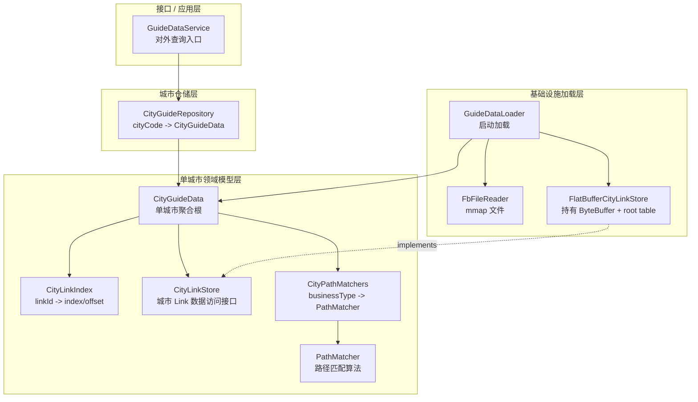
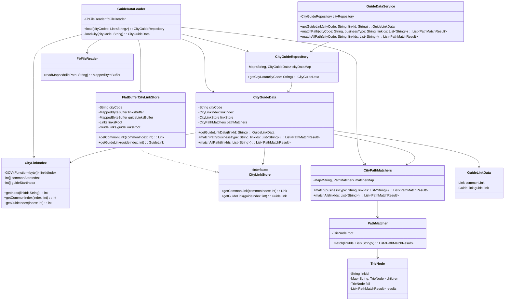
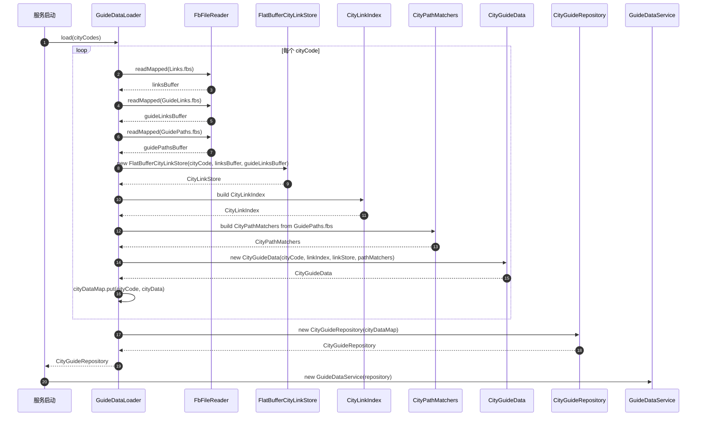
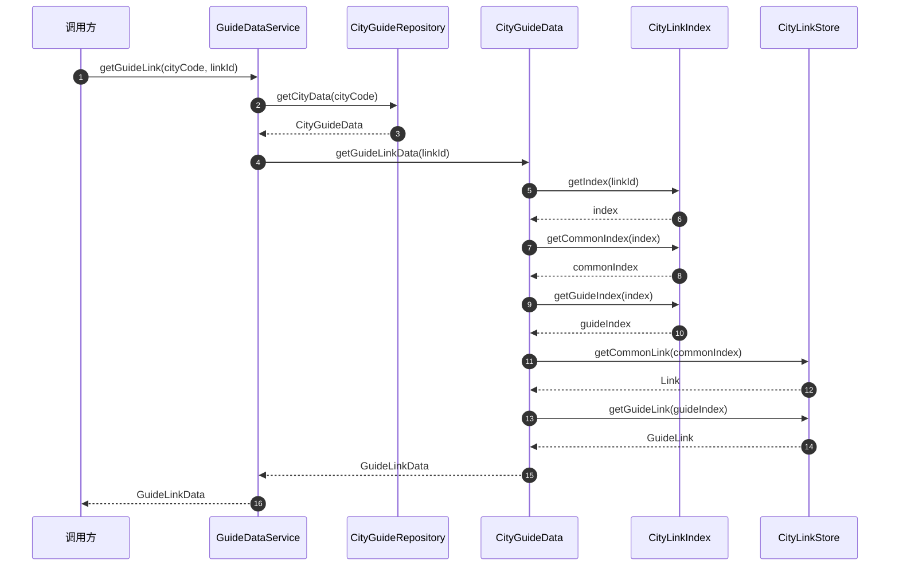
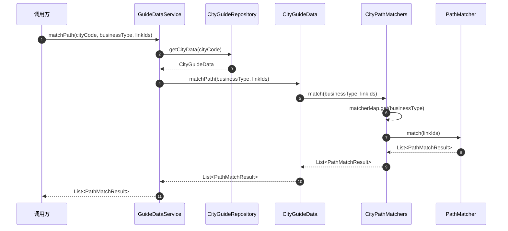

# 导航诱导数据服务技术方案

## 1. 背景

当前系统需要在服务启动时一次性加载多个城市的导航诱导相关数据，并在运行期提供高性能只读查询能力。

每个城市对应三类 FlatBuffer 数据文件：

```text
cityCode
  ├── Links.fbs
  ├── GuideLinks.fbs
  └── GuidePaths.fbs
```

其中：

- `Links`：普通 link 基础数据。
- `GuideLinks`：诱导 link 数据。
- `GuidePaths`：诱导路径数据。

运行期主要提供两类能力：

1. 根据 `cityCode + linkId` 查询普通 link 与诱导 link 数据。
2. 根据 `cityCode + businessType + linkIds` 做路径匹配。

---

## 2. 设计目标

本方案的目标是：

1. **启动加载，运行只读**  
   服务启动时一次性加载所有目标城市数据，运行期只做内存查询。

2. **按城市隔离数据**  
   每个城市独立持有自己的 `Links / GuideLinks / GuidePaths` 数据，避免误设计成全局大对象。

3. **清晰分层**  
   对外服务层、城市仓储层、单城市领域模型层、基础设施加载层职责清楚。

4. **封装 FlatBuffer 细节**  
   外部调用方不直接接触 `ByteBuffer`、root table、offset、index 等底层细节。

5. **支持一个城市多个业务类型 PathMatcher**  
   一个 `cityCode` 下可以根据不同 `businessType` 挂载多个路径匹配器。

6. **避免过度设计**  
   不引入没有明确价值的 `RuntimeContext`、全局 Holder、拆分过细的查询 Service。

---

## 3. 总体分层

整体分为四层：



---

## 4. 核心运行期结构

服务启动完成后，运行期核心数据结构如下：

```text
CityGuideRepository
  └── Map<cityCode, CityGuideData>
        └── CityGuideData
              ├── CityLinkIndex
              │     ├── GOV4Function<byte[]> linkIdIndex
              │     ├── int[] commonStartIndex
              │     └── int[] guideStartIndex
              │
              ├── CityLinkStore
              │     └── FlatBufferCityLinkStore
              │           ├── Links.fbs buffer + Links root
              │           └── GuideLinks.fbs buffer + GuideLinks root
              │
              └── CityPathMatchers
                    └── Map<businessType, PathMatcher>
```

如果 `GuidePaths.fbs` 只在启动阶段用于构建 `PathMatcher`，运行期不需要再访问 root table，那么它可以只在加载阶段使用，不必保留在 `FlatBufferCityLinkStore` 中。

如果后续有调试、追踪、二次查询 `GuidePaths` 原始数据的需求，可以新增 `FlatBufferCityPathStore` 或让加载器保留对应 root table。

---

## 5. 核心类职责

### 5.1 GuideDataService

对外入口，暴露业务查询接口。

职责：

- 参数校验。
- 根据 `cityCode` 获取城市数据。
- 调用 `CityGuideData` 的业务方法。
- 不关心 FlatBuffer、ByteBuffer、index、offset 等细节。

示例：

```java
public class GuideDataService {

    private final CityGuideRepository cityRepository;

    public GuideLinkData getGuideLink(String cityCode, String linkId) {
        return cityRepository
                .getCityData(cityCode)
                .getGuideLinkData(linkId);
    }

    public List<PathMatchResult> matchPath(
            String cityCode,
            String businessType,
            List<String> linkIds
    ) {
        return cityRepository
                .getCityData(cityCode)
                .matchPath(businessType, linkIds);
    }

    public List<PathMatchResult> matchAllPath(
            String cityCode,
            List<String> linkIds
    ) {
        return cityRepository
                .getCityData(cityCode)
                .matchAllPath(linkIds);
    }
}
```

---

### 5.2 CityGuideRepository

城市数据仓储，负责管理所有城市的运行期数据。

职责：

- 持有 `Map<String, CityGuideData>`。
- 根据 `cityCode` 获取单城市数据。
- 隐藏底层 Map 结构。

示例：

```java
public class CityGuideRepository {

    private final Map<String, CityGuideData> cityDataMap;

    public CityGuideRepository(Map<String, CityGuideData> cityDataMap) {
        this.cityDataMap = Map.copyOf(cityDataMap);
    }

    public CityGuideData getCityData(String cityCode) {
        CityGuideData cityData = cityDataMap.get(cityCode);
        if (cityData == null) {
            throw new IllegalArgumentException("City data not found: " + cityCode);
        }
        return cityData;
    }
}
```

说明：

- 原先讨论过的 `GuideRuntimeContext` 可以去掉。
- 如果它只是包装一个 Map，语义不如 `CityGuideRepository` 明确。
- 只有未来需要热更新、多版本切换、整体生命周期管理时，才有必要引入类似 Context 的对象。

---

### 5.3 CityGuideData

单城市聚合根，是本方案最核心的领域对象。

职责：

- 聚合一个城市的索引、数据访问和路径匹配能力。
- 对外提供面向业务的查询方法。
- 不向外暴露 FlatBuffer root table、ByteBuffer、内部 index 细节。

示例：

```java
public class CityGuideData {

    private final String cityCode;
    private final CityLinkIndex linkIndex;
    private final CityLinkStore linkStore;
    private final CityPathMatchers pathMatchers;

    public GuideLinkData getGuideLinkData(String linkId) {
        int index = linkIndex.getIndex(linkId);
        if (index < 0) {
            return null;
        }

        int commonIndex = linkIndex.getCommonIndex(index);
        int guideIndex = linkIndex.getGuideIndex(index);

        Link commonLink = linkStore.getCommonLink(commonIndex);
        GuideLink guideLink = linkStore.getGuideLink(guideIndex);

        return new GuideLinkData(commonLink, guideLink);
    }

    public List<PathMatchResult> matchPath(
            String businessType,
            List<String> linkIds
    ) {
        return pathMatchers.match(businessType, linkIds);
    }

    public List<PathMatchResult> matchAllPath(List<String> linkIds) {
        return pathMatchers.matchAll(linkIds);
    }
}
```

这个类保证外层调用不会变成：

```java
cityData.getFlatBuffers().getGuideLinksRoot().guideLinks(index);
```

而是保持为：

```java
cityData.getGuideLinkData(linkId);
```

这也是本方案中最重要的面向对象封装点。

---

### 5.4 CityLinkIndex

城市级 link 索引。

职责：

- 维护 `linkId -> index` 的映射。
- 维护普通 link 与诱导 link 的 index/offset 定位数组。
- 不持有 FlatBuffer root table。

示例：

```java
public class CityLinkIndex {

    private final GOV4Function<byte[]> linkIdIndex;
    private final int[] commonStartIndex;
    private final int[] guideStartIndex;

    public int getIndex(String linkId) {
        return linkIdIndex.get(linkId.getBytes(StandardCharsets.UTF_8));
    }

    public int getCommonIndex(int index) {
        return commonStartIndex[index];
    }

    public int getGuideIndex(int index) {
        return guideStartIndex[index];
    }
}
```

说明：

- `CityLinkIndex` 只做索引，不做数据读取。
- 这样可以避免 `CityLinkIndex` 同时负责索引和 FlatBuffer 访问，职责过重。

---

### 5.5 CityLinkStore

城市 link 数据访问接口。

职责：

- 抽象“通过 index 读取普通 link / 诱导 link”。
- 屏蔽底层是 FlatBuffer、内存对象还是其他存储形式。

```java
public interface CityLinkStore {

    Link getCommonLink(int commonIndex);

    GuideLink getGuideLink(int guideIndex);
}
```

---

### 5.6 FlatBufferCityLinkStore

`CityLinkStore` 的 FlatBuffer 实现。

职责：

- 持有当前城市的 `Links.fbs` 和 `GuideLinks.fbs` 对应的 `MappedByteBuffer`。
- 持有对应 FlatBuffer root table：`Links` 和 `GuideLinks`。
- 根据 index 从 root table 中读取数据。

示例：

```java
public class FlatBufferCityLinkStore implements CityLinkStore {

    private final String cityCode;

    private final MappedByteBuffer linksBuffer;
    private final MappedByteBuffer guideLinksBuffer;

    private final Links linksRoot;
    private final GuideLinks guideLinksRoot;

    public FlatBufferCityLinkStore(
            String cityCode,
            MappedByteBuffer linksBuffer,
            MappedByteBuffer guideLinksBuffer
    ) {
        this.cityCode = cityCode;
        this.linksBuffer = linksBuffer;
        this.guideLinksBuffer = guideLinksBuffer;
        this.linksRoot = Links.getRootAsLinks(linksBuffer);
        this.guideLinksRoot = GuideLinks.getRootAsGuideLinks(guideLinksBuffer);
    }

    @Override
    public Link getCommonLink(int commonIndex) {
        return linksRoot.links(commonIndex);
    }

    @Override
    public GuideLink getGuideLink(int guideIndex) {
        return guideLinksRoot.guideLinks(guideIndex);
    }
}
```

说明：

- ByteBuffer 和 root table 放在同一个对象中，生命周期清楚。
- `CityGuideData` 只依赖 `CityLinkStore` 接口，不直接依赖 FlatBuffer 实现。

---

### 5.7 CityPathMatchers

单城市路径匹配器集合。

职责：

- 一个城市下维护多个业务类型的 `PathMatcher`。
- 根据 `businessType` 选择对应 matcher。
- 支持匹配单业务类型，也支持匹配全部业务类型。

示例：

```java
public class CityPathMatchers {

    private final Map<String, PathMatcher> matcherMap;

    public List<PathMatchResult> match(
            String businessType,
            List<String> linkIds
    ) {
        PathMatcher matcher = matcherMap.get(businessType);
        if (matcher == null) {
            return Collections.emptyList();
        }
        return matcher.match(linkIds);
    }

    public List<PathMatchResult> matchAll(List<String> linkIds) {
        List<PathMatchResult> results = new ArrayList<>();
        for (PathMatcher matcher : matcherMap.values()) {
            results.addAll(matcher.match(linkIds));
        }
        return results;
    }
}
```

---

### 5.8 PathMatcher

路径匹配算法对象。

职责：

- 封装 Trie / AC 自动机相关实现。
- 对外只暴露 `match(linkIds)`。
- 不关心城市、FlatBuffer、文件加载。

```java
public class PathMatcher {

    private final TrieNode root;

    public List<PathMatchResult> match(List<String> linkIds) {
        // AC / Trie 匹配逻辑
    }
}
```

---

### 5.9 GuideDataLoader

启动加载器。

职责：

- 服务启动时加载所有城市数据。
- 对每个城市读取对应 fbs 文件。
- 构建 `FlatBufferCityLinkStore`、`CityLinkIndex`、`CityPathMatchers`、`CityGuideData`。
- 最后返回 `CityGuideRepository`。

```java
public class GuideDataLoader {

    private final FbFileReader fbFileReader;

    public CityGuideRepository load(List<String> cityCodes) {
        Map<String, CityGuideData> cityDataMap = new HashMap<>();

        for (String cityCode : cityCodes) {
            CityGuideData cityData = loadCity(cityCode);
            cityDataMap.put(cityCode, cityData);
        }

        return new CityGuideRepository(cityDataMap);
    }

    private CityGuideData loadCity(String cityCode) {
        // 1. mmap Links.fbs
        // 2. mmap GuideLinks.fbs
        // 3. mmap GuidePaths.fbs
        // 4. build FlatBufferCityLinkStore
        // 5. build CityLinkIndex
        // 6. build CityPathMatchers
        // 7. return CityGuideData
    }
}
```

---

### 5.10 FbFileReader

底层文件读取器。

职责：

- 只负责读取文件并返回 `MappedByteBuffer`。
- 不解析业务数据。
- 不构建索引。

```java
public class FbFileReader {

    public MappedByteBuffer readMapped(String filePath) {
        // mmap file
    }
}
```

---

## 6. 最终类图



---

## 7. 启动加载流程



---

## 8. GuideLink 查询调用链



---

## 9. 路径匹配调用链



---

## 10. 为什么这个设计不是简单面向过程拆类

判断是不是面向对象，关键不是类的数量，而是：

> 外层是否在直接操作对象内部零件。

不推荐的过程式调用：

```java
CityGuideData cityData = repository.getCityData(cityCode);
int index = cityData.getLinkIndex().getIndex(linkId);
Link link = cityData.getFlatBuffers().getLinksRoot().links(index);
```

这种写法虽然有类，但业务流程散落在外层，封装性弱。

推荐的面向对象调用：

```java
GuideLinkData data = repository
        .getCityData(cityCode)
        .getGuideLinkData(linkId);
```

此时：

- `GuideDataService` 不知道 index 怎么算。
- `GuideDataService` 不知道 FlatBuffer 怎么读取。
- `GuideDataService` 不知道普通 link 和诱导 link 怎么组合。
- 这些细节都封装在 `CityGuideData` 内部。

所以 `CityGuideData` 是单城市聚合根，而不是普通 DTO。

---

## 11. 为什么不保留 GuideRuntimeContext

之前讨论过 `GuideRuntimeContext`，但当前方案中建议去掉。

原因：

```text
GuideRuntimeContext
  └── Map<cityCode, CityGuideData>
```

如果它只是包装一个 Map，那么语义不够明确，也没有额外行为。

更合适的是：

```text
CityGuideRepository
  └── Map<cityCode, CityGuideData>
```

`CityGuideRepository` 的语义更清楚：

- 它是城市数据仓储。
- 它负责根据 `cityCode` 获取城市数据。
- 它隐藏城市数据 Map。

未来如果需要热更新，可以再引入：

```java
AtomicReference<CityGuideRepository> repositoryRef;
```

通过整体替换 repository 实现无锁读、原子切换。

---

## 12. 为什么不保留 GuideLinkQueryService / GuidePathMatchService

当前查询逻辑比较薄：

```text
GuideDataService
  -> CityGuideRepository
  -> CityGuideData
```

如果额外拆成：

```text
GuideDataService
  -> GuideLinkQueryService
  -> GuidePathMatchService
```

而这两个 Service 只是转发，那么会增加理解成本。

因此当前不建议保留。

后续如果出现以下情况，再考虑拆分：

1. link 查询逻辑变复杂，例如需要批量查询、降级、统计、缓存命中监控。
2. path 匹配逻辑变复杂，例如需要多策略合并、优先级裁剪、并行匹配。
3. 两类能力的演进方向明显不同。

---

## 13. 对 ByteBuffer 和 root table 的最终处理方式

每个城市独立持有自己的 fbs 文件，因此 ByteBuffer 和 root table 不应该放在全局 Holder 里。

推荐：

```text
FlatBufferCityLinkStore
  ├── linksBuffer
  ├── guideLinksBuffer
  ├── linksRoot
  └── guideLinksRoot
```

如果 `GuidePaths.fbs` 只用于启动阶段构建 `PathMatcher`：

```text
GuideDataLoader
  └── 读取 GuidePaths.fbs
      └── 构建 CityPathMatchers
          └── 构建完成后不再保留 GuidePaths root
```

如果运行期还需要访问原始 `GuidePaths`：

```text
FlatBufferCityPathStore
  ├── guidePathsBuffer
  └── guidePathsRoot
```

再由 `CityPathMatchers` 或 `CityGuideData` 持有。

当前优先推荐第一种：

> `GuidePaths.fbs` 启动阶段用于构建 matcher，运行期只保留 `PathMatcher`。

---

## 14. 本方案的优点

1. **数据归属清楚**  
   每个城市的数据独立封装在 `CityGuideData` 中。

2. **FlatBuffer 生命周期清楚**  
   ByteBuffer 和 root table 由 `FlatBufferCityLinkStore` 持有，不散落在多个类里。

3. **外层调用简单**  
   `GuideDataService` 只调用业务方法，不拼装底层流程。

4. **多业务路径匹配自然支持**  
   `CityPathMatchers` 通过 `Map<businessType, PathMatcher>` 支持一个城市多个 matcher。

5. **避免无效包装层**  
   去掉 `GuideRuntimeContext`，使用语义更明确的 `CityGuideRepository`。

6. **可扩展但不过度设计**  
   当前只保留必要抽象，后续可根据复杂度再拆 Service 或支持热更新。

---

## 15. 最终推荐类清单

建议保留：

```text
GuideDataService
CityGuideRepository
CityGuideData
CityLinkIndex
CityLinkStore
FlatBufferCityLinkStore
CityPathMatchers
PathMatcher
TrieNode
GuideDataLoader
FbFileReader
GuideLinkData
PathMatchResult
```

暂时不建议保留：

```text
GuideRuntimeContext
GuideFlatBufferStore
FbGlobalHolder
GuideLinkQueryService
GuidePathMatchService
CityLinkFbView
```

除非后续出现更明确的需求。

---

## 16. 一句话总结

本方案的核心是：

> `CityGuideRepository` 管所有城市，`CityGuideData` 管单城市完整查询能力，`FlatBufferCityLinkStore` 管单城市 fbs 数据，`CityLinkIndex` 管 link 索引，`CityPathMatchers` 管多业务路径匹配。外层只调用业务方法，不直接操作 ByteBuffer、root table 和 index。

