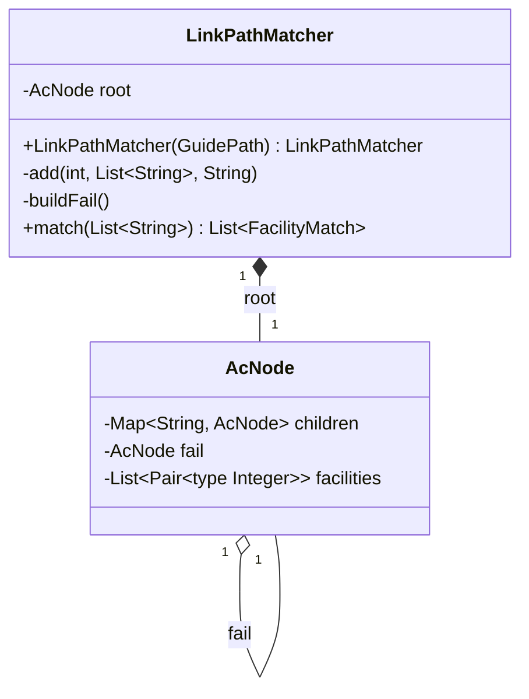

```mermaid
classDiagram
    class LinkPathMatcher {
        -AcNode root
        +LinkPathMatcher(GuidePath) LinkPathMatcher
        -add(int, List~String~, String)
        -buildFail()
        +match(List~String~) List~FacilityMatch~
    }

    class AcNode {
        -Map~String, AcNode~ children
        -AcNode fail
        -List~Pair~type Integer~~ facilities
    }

    LinkPathMatcher "1" *-- "1" AcNode : root
    AcNode "1" o-- "*" AcNode : children
    AcNode "1" o-- "1" AcNode : fail
```
问题：fbs是否支持多线程访问，不支持则使用bb每次创建单独实图
问题：是否所有都是路线的完全匹配
linkprofile---统一收口到一个linkProfileUtile的工具类里面
验证
